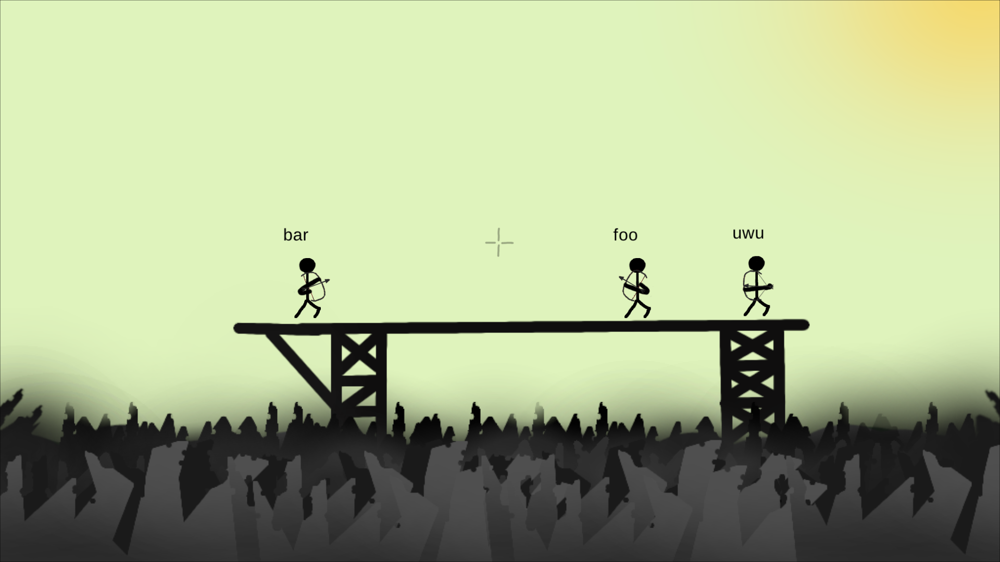

# chichilku3
The stick game in the 3rd generation written in ruby



# Setup

macOS
-----

```
brew install sdl2
bundle install
git clone https://github.com/chichilku/chichilku3
cd chichilku3
```

linux
-----

```
sudo apt install libfontconfig1-dev libsndfile1-dev libsdl2-dev libmpg123-dev libopenal1 libopenal-dev
bundle install
git clone https://github.com/chichilku/chichilku3
cd chichilku3
```

# client

``ruby client/game.rb``

# server

``ruby server/server.rb``
